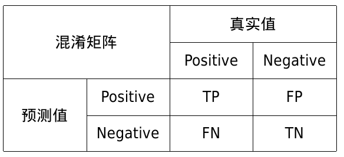
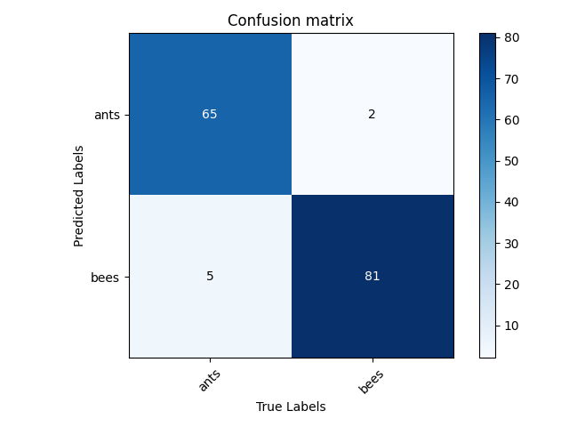

# Confusion Matrix



T: 预测正确

F: 预测错误

P: 预测为真

N: 预测为假

准确率(ACC), Accuarcy

- 预测正确的比例

$$
Accuracy = \frac{TP+TN}{TP+TN+FN+TN}
$$

精确率, Precision

- 预测为正的样本，预测正确的比例

$$
Precision = \frac{TP}{TP + FP}
$$

召回率

- 真实值为正的样本，预测正确的比例

$$
Recall = \frac{TP}{TP + FP}
$$

举例子：

在推荐搜素中，粗排比较关心用户想要的网页尽可能多的被召回，关注召回率指标；精排更关心用户想要的网页尽可能的排到top页面，关注精确率指标。

地震预警器，每一次地震前尽可能地都被预警到->召回率；每次预警，尽可能的都预测准->精确率。

## Code



混淆矩阵的计算，每次计算的结果，累加至对应位置即可

```python
# main.py:20-22
def update(self, preds, labels):
    for p, t in zip(preds, labels):
        self.matrix[p, t] += 1
```

P，R的计算

```python
# main.py:35-40
for i in range(self.num_classes):
    TP = self.matrix[i, i]
    FP = np.sum(self.matrix[i, :]) - TP
    FN = np.sum(self.matrix[:, i]) - TP
    Precision = round(TP / (TP + FP), 3) if TP + FP != 0 else 0.
    Recall = round(TP / (TP + FN), 3) if TP + FN != 0 else 0.
```

结果：

```text
+------+-----------+--------+
|      | Precision | Recall |
+------+-----------+--------+
| ants |    0.97   | 0.929  |
| bees |   0.942   | 0.976  |
+------+-----------+--------+
```

ants-Precision: $65/(65+2)=0.97$

bees-Recall: $81/(81+2)=0.976$
