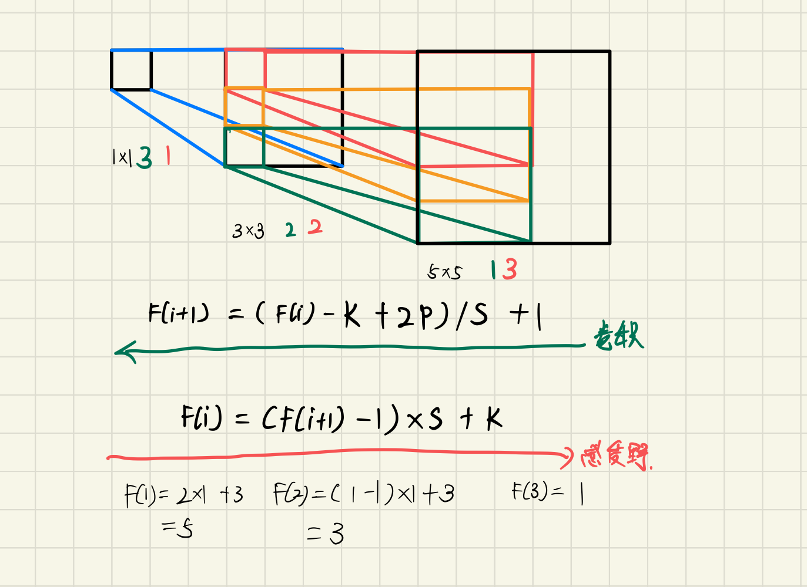

# VGG (Visuval Geometry Group Net)

[Very Deep Convolutional Networks for Large-Scale Image Recognition](https://arxiv.org/abs/1409.1556)

## 论文亮点

通过堆叠多个3x3的卷积核替代大尺度卷积核（减少所需参数）

堆叠两个 3x3 的卷积核 替代 5x5 的卷积核， 堆叠 7x7 的卷积核

网络结构


## CNN 感受野



F(i) 第i层感受野

S 步长

K 卷积核大小

P Padding 

CONV2D 5x5 1x vs CONV2D 3x3 2x

conv5x5: 

```python
conv5 1x = 5*5*C*C + 5 = 25*C**2 + 5
conv3 2x = (3*3*C*C + 3)*2 = 9*C**2 + 6
```

当 C >> K 时， 25C^2 > 9C^2

## 参考
https://www.bilibili.com/video/BV1q7411T7Y6/?spm_id_from=333.788&vd_source=32cd95948225d926dab15b2fdcf74c8d

https://github.com/pytorch/vision/blob/main/torchvision/models/vgg.py


