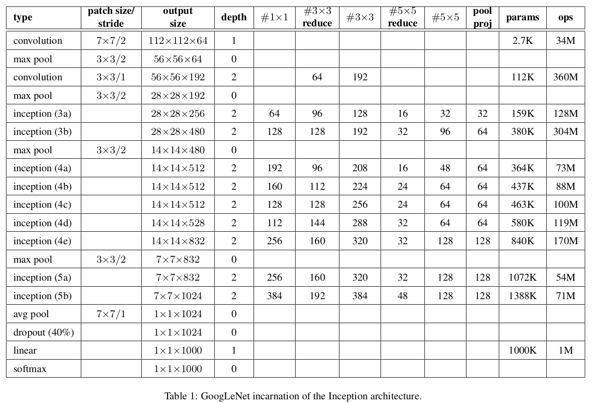
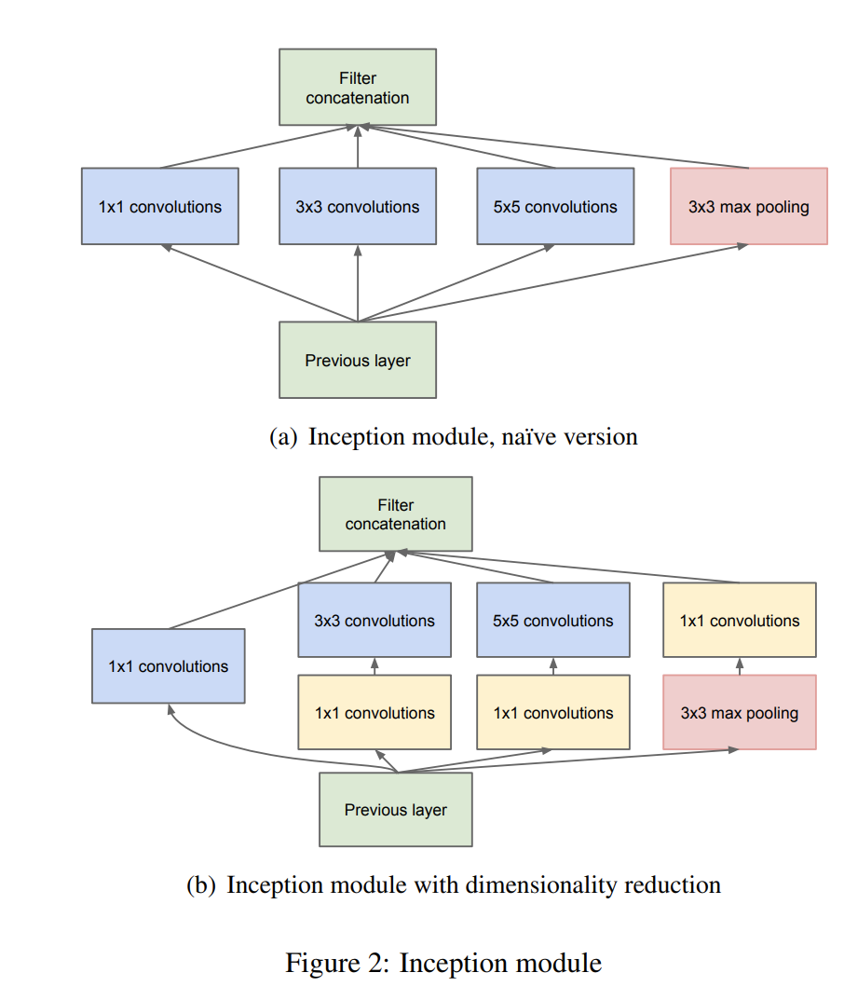
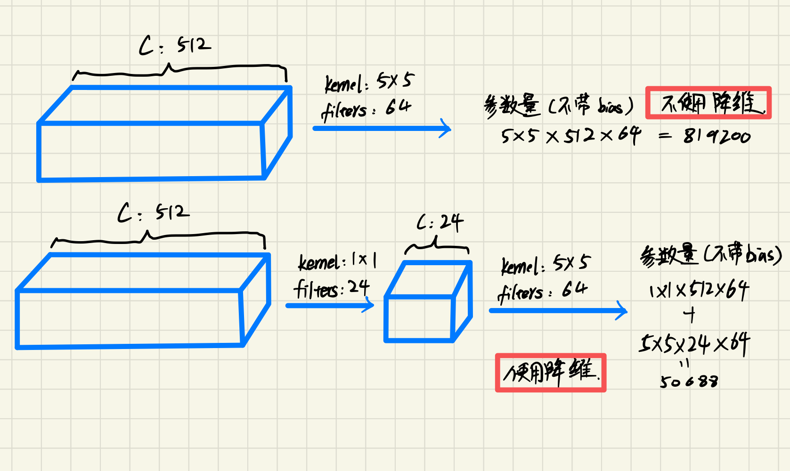
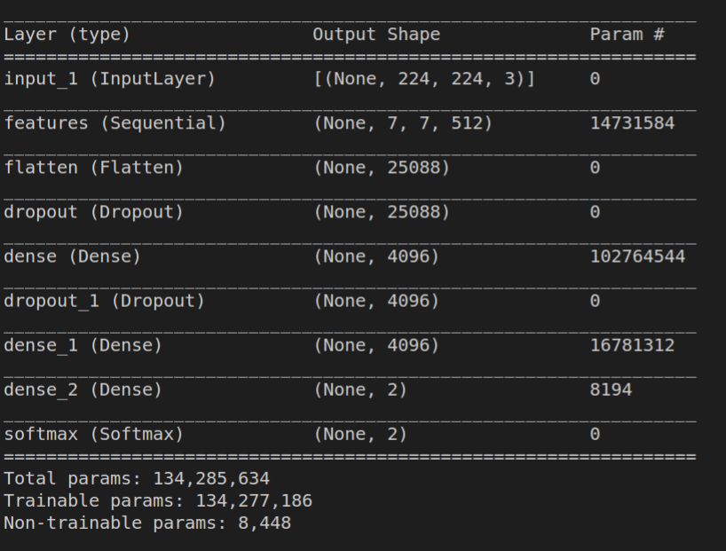

# VGG (Visuval Geometry Group Net)

[Going Deeper with Convolutions](https://arxiv.org/abs/1409.4842v1)

**论文亮点**

- 引入Inception结果（融合多尺度的特征信息）
- 使用1x1卷积核进行降维及映射处理
- 添加两个辅助分类器帮助训练
- 丢弃全连接层，使用平均池化层（大大减少模型参数）

**网络结构**

**Inception Module**

**1x1的卷积在其中起到降维的作用**

**辅助分类器**

- 平均池化5x5,步长3，输入14x14： (14 - 5)/3 + 1 = 4 -> 输出：4x4xC
- 1x1 conv, 降维至 128
- FC, 输出 1024维度
- dropout layer 0.7
- 线性层分类1000, softmax loss

**与VGG参数的区别**

vgg最后一层没有平均池化层，直接flatten后接全连接，这一步参数量极大，有1亿参数。

当然中间的降维也能极大的减少参数

**参考**

https://www.bilibili.com/video/BV1z7411T7ie/?spm_id_from=333.788&vd_source=32cd95948225d926dab15b2fdcf74c8d

https://github.com/pytorch/vision/blob/main/torchvision/models/vgg.py

https://tensorflow.google.cn/guide/keras/writing_a_training_loop_from_scratch#low-level_handling_of_metrics

